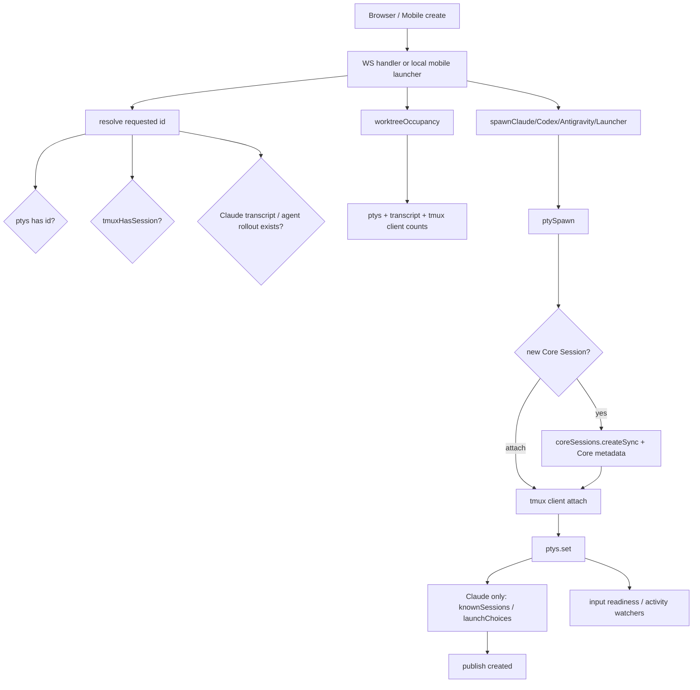
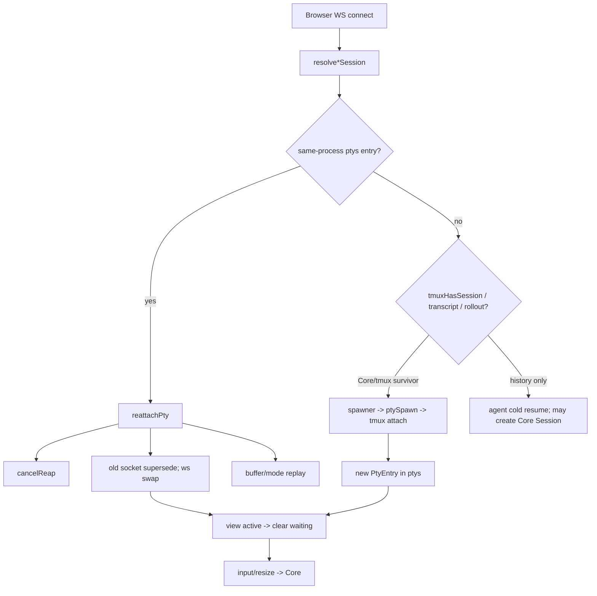
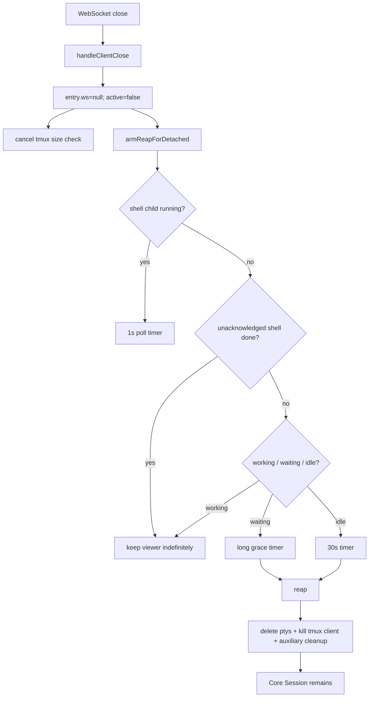
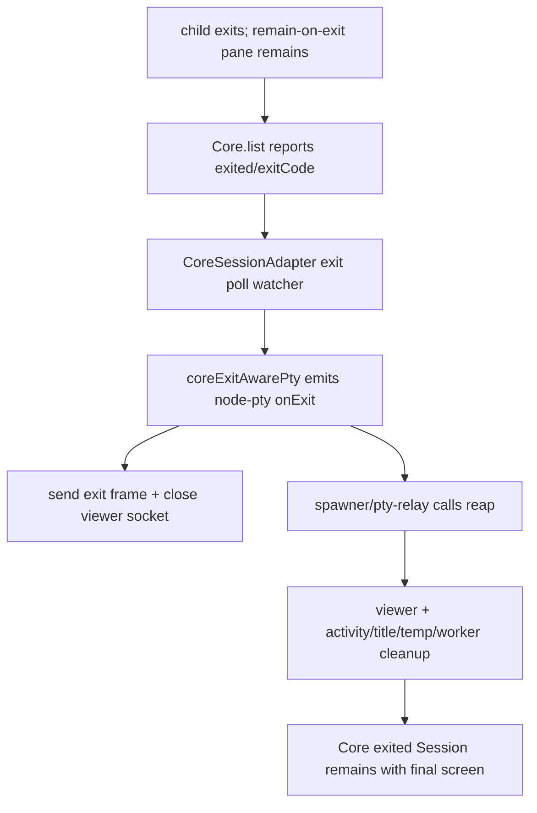
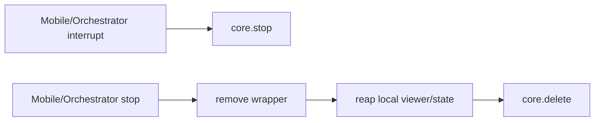
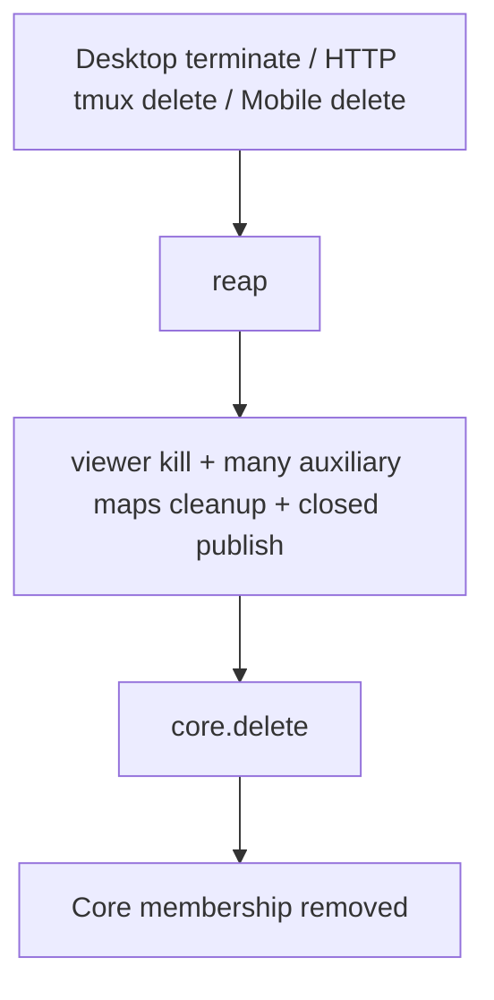
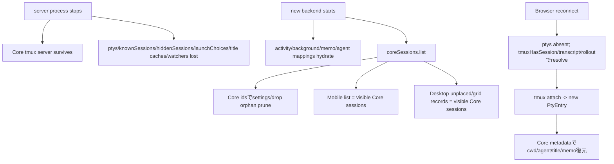

# Issue #166: Core化後のBackend状態管理棚卸し

調査対象: `dev/v1.3.0` (`ddd3fea9`)、2026-08-26時点。Issue #165 / #166を仕様・方針として、`tmux-session-core-ts` / Core専用tmux serverをSession existence・native lifecycle・lifetimeの唯一のSoTとみなした。

## 結論

Core membershipはMobile一覧とDesktop gridの再発見では既に使われているが、接続解決、worktree占有判定、補助route、stop/delete、viewer解放では`ptys`、tmux直接照会、transcript、`knownSessions`、activityがまだ判断材料になっている。特に次の3点は#165の契約と一致しない。

1. `server/session/pty-connection.ts`のdisconnectがviewer detachだけで終わらず、activity・shell child process・grace timerを経由して`reap()`を決める。
2. Mobile / Orchestratorの`stopSession`が`reap()` + `core.delete()`であり、StopではなくDeleteになっている。`interruptSession`だけが`core.stop()`へ到達する。
3. `server/session/lifecycle.ts`がviewer解放、UI activity、通知、agent worker成否、title、temporary file cleanupを一つの`reap()`へ集約し続けている。

一方、現行`reap()`はtmux-backed sessionについて`entry.term.kill()`でMulmoTerminalのtmux clientを切るだけで、Core/tmux membership自体は削除しない。したがって「disconnectでCore Sessionを削除している」というより、「viewer解放をSession lifecycleとして表現し、activityで解放時期を変えている」ことが主問題である。Core membershipを消すのは明示的な`core.delete()`経路と、内部workerのretention cleanupである。

判定番号は#166の分類をそのまま用いる。

- 1: Coreと重複しているので削除
- 2: viewer / transportとして必要
- 3: UI activity / notificationとして必要
- 4: agent固有補助として必要
- 5: 不要なので削除

## 状態管理一覧

| state / module | owner | purpose | persistent? | Session existenceに影響? | Coreと重複? | 判定 |
| --- | --- | --- | --- | --- | --- | --- |
| `CoreSessionAdapter.core` / Core metadata (`agent`,`cwd`,`title`,`memo`) | Core adapter / Core | create/list/get/screen/input/resize/stop/deleteと再構築metadata | Core/tmux | Yes（正規SoT） | No | 2: 薄いadapterとして残す |
| `CoreSessionAdapter.inputTails` | Core adapter | 同一sessionへのinput順序保証 | No | No | No | 2: transport直列化として残す |
| `CoreSessionAdapter.exitWatchers`, `exitPollTimer`, `exitPollInFlight` | Core adapter | remain-on-exitをnode-pty exit相当に変換 | No | No。membershipは変更しない | native exitの値はCore由来 | 2: Coreにevent APIが無い間のexit観測として残す。viewer通知に加えactivity終端化とagent一時resource cleanupへ通知し、`reap`連携は削除 |
| `ptys: Map<string,PtyEntry>` | `registry.ts` / spawners | node-pty tmux client、WS、接続中replay buffer、viewer flags | No | **現状Yes**: WS resolver、worktree occupancy、drop route、runtime判定が`has/get`を存在・利用可否に使用 | membership部分のみ重複 | 2: viewer registryへ縮小。`term/ws/buffer/redrawPending`は接続中transport stateに限定し、membership sourceとしての参照を削除。再接続時のscrollbackはCore `screen()`から再構築する |
| `PtyEntry.active` | viewer / hook UI | 現在見ているpaneか、waiting通知を抑止するか | No | No | No | 3: UI read/attentionとして残す |
| `PtyEntry.cwd/agent` | viewer cache | hook/通知/submitの同期参照 | No | 一部routeでYes | Core metadataと重複 | 2: 接続中cacheとしてのみ許容。存在・一覧・再構築はCoreを読む |
| `PtyEntry.tmux` | viewer | persistent clientかの分岐 | No | 一部 | v1.3.0では全SessionがCore/tmux | 1: session viewerから削除候補（session-less `/ws/run`は別） |
| `activity` (`working`,`waiting`,`event`,`at`) | UI activity | hook/Codex watcher/shell watcherからattention、sound、push、roster表示 | `activity-state.json` | **現状Yes**: reap timingとinput可否に使用 | No（agent semanticでCore native lifecycleではない） | 3: 残すが表示/通知専用。existence、Stop/Delete、viewer lifetimeから切り離す |
| `ownedActivityIds`, `activityPersist`, hydration | activity persistence | multi-process安全にactivityをrestart越し復元 | Yes | 現状reap経由で間接影響 | No | 3: 必要性はUI restart復元に限定。Core一覧にjoinし、Coreに無いidをrow化しない |
| lifecycle内`mobileWebPushActivityState` | activity notifier | transition dedupe | No | No | No | 3: notifier/activity moduleへ移す |
| hook route `activeWaitingMobileWebPushSent` | activity notifier | active中Notification pushの重複抑止 | No | No | No | 3: 残す。Session lifecycleから独立 |
| `workPhaseTracker.turnTools` | UI activity | planning/implementing表示 | No | No | No | 3: 残す。Core membershipにjoinして表示のみ |
| `reapTimers`, `REAP_GRACE_MS`, `WAIT_REAP_GRACE_MS` | `lifecycle.ts` | disconnect後のviewer解放時刻をactivityで変更 | No | Core membershipにはNo、viewer lifetimeにはYes | Core lifecycleではないが#165で禁止 | 5: 削除 |
| `deferredStops`, `childProcessBaselines` | `lifecycle.ts` | Claude Stop後も新規childがいる間working/waiting遷移を遅延 | No | 現状reap判断へ流入 | No | 4: agent activity精度として必要ならactivity moduleへ移す。Session保持との結合は削除 |
| `unacknowledgedShellDone` | `lifecycle.ts` | shell完了を画面表示までreapしない | No | viewer lifetimeにYes | No | 5: 削除。未読は`activity.waiting`だけで表現し、Session保持理由にしない |
| `shell-task-watch.watches` + poll timer | shell activity | foreground taskの開始/10秒以上の完了をworking/waiting通知へ変換 | No | **現状Yes**: reap保持にも使う | No | 3: shell UI通知として残す余地あり。保持判定を削除しactivity producerに限定 |
| `child-processes.ts` process scan helpers | agent activity | shell task検知、Claude Stop defer | No | 現状reap保持にYes | No | 3/4: 上記2 producerが必要な範囲だけ残す。`armReapForDetached`からの利用は削除 |
| `knownSessions` + `collectPendingSessions` + `partitionPending` | legacy chat list | transcript未作成Sessionをin-memory row化 | No | **Yes**: `/api/sessions`のrow source | Core.list/metadataと重複 | 1: 削除。terminal membership/pending表示はCoreから構築 |
| `hiddenSessions` + `backgroundMarkers` live half | legacy visibility | live background workerを隠す | No | list visibilityにYes | persisted `backgroundSessions`と二重 | 5: `hiddenSessions`を削除し、background classification一系統へ統合 |
| persisted `backgroundSessions` | agent helper classification | internal/background row filterとpush policy | Yes | No（visibilityのみ） | No | 4: 残す。Core sessionを発生させるsourceにはしない |
| `translationWorkerIds` | translation worker | process-local internal helper filter | No | No（visibilityのみ） | No | 4: 残す。restart後はpersisted background classificationで隠す |
| `userScheduledSessions`, `failedWorkers` | scheduler/worker notifications | scheduled push例外、worker失敗表示 | Yes | No（内部worker cleanupは別） | No | 4: 残す |
| `scheduledSessions` registry + hourly sweep | internal scheduled workers | internal workerの件数/TTL retention、明示的Core delete | JSON records | **Yes（内部workerのみ）** | No | 4: user Session lifecycleとは分離した内部agent job retentionとして残す。対象idのbackground ownershipを必須条件にする |
| `completionHooks` | background agent jobs | Stop成功またはcleanup失敗をone-shot通知 | No | 現状`reap()`に失敗判定を依存 | No | 4: 残す。worker owner/exit observerへ移し、汎用viewer releaseを失敗扱いしない |
| `pendingTranslations` + timeout | translation worker | headless agent request/response待ちとtimeout | No | timeout時に内部Core sessionをdelete | No | 4: 内部agent jobとして残す |
| `launchChoices` | Claude provider resolver | 同一process内のcold resume時にprovider/modelを再利用 | No | reconnectのspawn内容に影響 | Core metadataには未収容だが、reap前提でのみ必要 | 5: 削除。Core Sessionが存在する間はattachし、存在しないidは新規create。必要なlaunch metadataならCoreへ保存する別仕様が先 |
| `codexRolloutIds`, `claimedCodexRollouts` | Codex adapter | MulmoTerminal idとCodex rollout id対応、重複claim防止 | mappingはYes | No（list sourceにしない設計） | No | 4: agent resume補助として残す |
| `antigravityConversations`, claimed/written ids | Antigravity adapter | conversation id/cwd対応、cold resume | mappingはYes | No（visibility sourceにしない） | No | 4: agent resume補助として残す |
| `hookedSessions` | Claude/MCP integration | tool-call二重記録防止 | No | No | No | 4: agent補助として残す（直接Map exportは後で局所化） |
| `allToolsSessions`, `toolGroupsBySession`, reset ids | MCP agent integration | sessionが持つGUI tool capability | Yes | No | No | 4: agent capabilityとして残す |
| `lastPrompts`, `lastResponses` | UI header/notification | current task/replyの低コストcache | No（transcriptから再取得） | No | No | 3: 残す。Core membershipにjoinして表示のみ |
| `aiTitles` | title manager | generated title cache | No | No | Core `title` metadataと二重write/read | 1: 削除しCore metadataを唯一のtitle sourceにする |
| `titleTurnCounts`, `titlePending`, `titleInFlight`, `titleEpoch`, `lastTitledUserTurns`, `lastTitleAttemptMs` | title manager | generation trigger/race/backoff | No | No | No | 3: UI title生成の一時stateとして残す。delete時cleanupはtitle ownerが行う |
| `sessionMemos`, hydration/write guards/files | conversation history metadata | Core membership消滅後も残るtranscript/history rowのuser memoを保存 | Yes | No | live Core sessionについてのみCore `memo`と重複 | 3: history-owned UI metadataとして残す。Core存在中のmirror/fallback利用はやめ、Delete前に必要ならmemoをhistory側へarchiveする |
| `clearedTranscripts` markers | Claude UI helper | `/clear`後に旧transcriptのprompt/reply/titleを再表示しない | Yes | No | No | 4: Claude固有の表示補助として残す |
| `inputReadiness.states` + quiet timers | orchestrator helper | TUI outputから入力ready推測 | No | No | No | 5: productionでは`stateOf()`が未使用でstatusはCore runningを直接ready扱い。trackerとtimerを削除し、auth utilityは別moduleへ |
| `tmuxSizeSync.pending/tickets/wanted/unclosable` | viewer transport | browser sizeとtmux windowの補正 | No | No | No | 2: viewer transportとして残す。cleanupをviewer releaseへ移す |
| terminal input sender `chains` | Mobile/Orchestrator transport | pasteとsubmitのsession別直列化 | No | No | `CoreSessionAdapter.inputTails`とは異なる高位sequence | 2: transportとして残す |
| `toolStores` | GUI agent transport | tool result/historyのsession別一時store | 一部store依存 | No | No | 4: agent GUI補助として残す |
| `dir-session.ts` live candidate / occupancy | worktree admission/UI | 現存Sessionによるworktree占有を`ptys`から推測 | No | **Yes**: create拒否/attach対象を決定 | Core.listと重複し、Codex/Antigravity survivorを見失う | 1: live candidateとoccupancy sourceをCore.list + Core metadataに置換し、`livePtyCandidates`を削除 |
| `dir-session.ts` transcript candidates | Claude history resume | Core membership消滅後のClaude会話をworktreeから再開候補として発見 | transcript | No。新しいCore Sessionをcreateする入力に限る | No（Terminal existenceではなくagent history） | 4: history resume sourceとして残す/agent history moduleへ移す。live occupancy・attached・Terminal一覧へ混ぜない |
| `worktree-session-limit.launchesInFlight` | create admission | 同時create raceのmutex | No | create可否のみ | Coreにatomic per-cwd constraintなし | 4: managed worktree agent admission補助として残す。membership判定はCore結果だけを使う |
| `sessionAttached()`の`ptys` + tmux client counts | UI/admission | viewer占有・takeover警告 | No | create/adopt可否に影響 | Core `attached`と一部重複 | 2: viewer ownership表示は残すがnative attachedはCoreへ統一 |
| startup orphan prune (`pruneOrphanSettings`,`pruneOrphanDrops`) | agent temporary resources | Core.listに無いsecret/settings/dropを削除 | filesystem | No | No | 4: Core.listをlive-id sourceにする現行方針で残す |

## 現行データフロー

### create



問題: createの正規membershipはCoreだが、その前段の「既存か」「worktreeを占有しているか」は`ptys`、tmux直接照会、transcriptにも分散している。

### browser attach



`ptys`はviewer transportとして妥当だが、attach対象の存在判定はCoreに統一すべきである。

### browser disconnect



目標は`WebSocket close -> viewer detach/release`だけである。activityは通知表示に残しても、viewer解放時刻を決めてはならない。

### process exit



Core exit観測とviewerへのexit通知は必要だが、汎用`reap()`へ全責務を流す必要はない。自動`core.delete()`は行っていない点は契約どおり。

### stop



現行では`interrupt`だけが#165のStop契約、`stop`はDelete契約になっている。Desktop gridのclose/WS `terminate`もStopではなくDeleteである（UI上close/deleteなら名称を明確にする）。

### delete



目標は`core.delete(id)`を正規操作にし、成功後にviewer releaseと各ownerの補助state cleanupを行うこと。Core deleteの前にactivity/lifecycle条件を置かない。

### server restart



一覧再発見はCore中心になっているが、再接続resolverはまだ`tmuxHasSession`とhistoryを直接照会する。activityは復元されるもののserver停止中のhookを欠落し得るため、native running/exitedの代替にはしてはならない。

## Desktop / Mobile一覧の現状

- Mobile Terminal一覧: `server/index.ts:mobileListTerminalSessions()`が`coreSessions.list()` -> `visibleCoreSessions()`からcandidate idsを作る。running/deadともCore membershipに含み、title/cwd/agent/memoはCore metadataを優先する。これは目標に最も近い。
- Desktop grid: `/api/sessions/unplaced`と`/api/sessions/grid-records`はCore一覧を起点にする。placementはbrowser localStorageでありSession existenceではない。`hasViewer`はunplaced adoptionを抑止するUI ownership policyに限って使う。
- Desktop Chat/sidebar `/api/sessions`: Claude transcript履歴とCodex/Antigravity自身のhistory一覧であり、Terminal Session membership一覧とは別物。ただし`knownSessions`をpending row sourceにし、Core idsをfilterへ使うため責務が混在している。conversation history APIとCore terminal list APIを明確に分ける。
- Worktree resume/occupancy: `dir-session.ts`が`ptys`とClaude transcriptをsourceにするためCore survivor、特にCodex/Antigravityを一貫して扱えない。Core一覧へ置換が必要。

## `lifecycle.ts`の分解

### 本当に必要な責務

- UI activity transition (`setWorking`, `setWaiting`) と`SESSIONS_CHANNEL` publish。
- prompt/reply/title/memoを載せたUI row構築。ただし値のownerはactivity/title/Core metadataでありlifecycleではない。
- Mobile Web Pushのactivity transition dedupe/notify。
- Core exitをviewerへ通知してviewer resourceをreleaseし、persisted activityを`working=false, waiting=false`へ終端化すること。Core membershipは変更しない。
- Core exit時にprovider settings/drop等、そのagent processだけが使うsecret/temporary resourceをcleanupすること。exited Core sessionも`Core.list()`には残るためstartup orphan pruneでは代替できない。
- explicit Core delete後、各ownerが自分の補助state/temp resourceを片付けること。
- background agent jobのsuccess/failure completion通知。ただし対象は登録済み内部workerだけ。

### 他moduleへ移す責務

| lifecycle symbol / block | 移動先（既存責務へ寄せ、新lifecycle層は作らない） |
| --- | --- |
| `setFlag`, `publishActivity`, `refreshLastResponse`, push transition state | `activity-transition.ts` / hook activity service / `mobile-web-push/activity-notifier.ts` |
| `deferredStops`, `childProcessBaselines` | Claude/shell activity producer。Session保持から完全分離 |
| viewerの`entry.term.kill`, `ptys.delete`, WS close, buffer/size cleanup | `pty-connection.ts`をviewer attach/detach/release ownerにする |
| `forgetTerminalSize` | viewer release |
| title bookkeeping cleanup | `session-title.ts` |
| work phase cleanup | `work-phase-tracker.ts` |
| settings/drop cleanup | agent process exit / explicit delete / process replacementのowner。startup orphan pruneはcrash補完としてCore.list基準で維持 |
| completion hook failure判定 | background worker owner / Core exit observer。browser disconnectやviewer releaseでは発火しない |
| translation/scheduled workerのCore delete | それぞれのagent job ownerに限定 |
| graceful shutdown cleanup | WebSocket server close + viewer `releaseAll`; Core Sessionには触れない |

### そのまま削除できる責務

- disconnect grace / waiting grace / auto-reap policyと全timer。
- activity/working/waiting/shell child processに基づくviewer/session保持判断。
- `unacknowledgedShellDone`による保持。
- `deleteSession()`という`reap()` alias。
- `reap()`をSession teardownの総称として使うAPI。
- `cleanupManagedLiveSessions()`がSession cleanupを名乗る構造（viewer一括releaseへ置換）。
- Core Sessionが無いのにactivity/hidden recordだけを残してrowの存在感を延命する判断。

## 削除候補（path / symbol）

### 直接削除

- `server/session/reap-policy.ts`: `reapDecisionFor`, `reapTimerDelay`, `parseWaitGraceMs`, `shouldForgetActivity`, `MAX_TIMER_MS`（module全体）。
- `server/session/lifecycle.ts`: `reapTimers`, `REAP_GRACE_MS`, `WAIT_REAP_GRACE_*`, `scheduleReap`, `scheduleDetachedShellTaskCheck`, `armReapForDetached`, `cancelReap`, `unacknowledgedShellDone`, `acknowledgeShellDone`の専用保持ロジック。
- `server/session/lifecycle.ts`: `deleteSession` alias。最終段階で`createSessionLifecycle`とmodule全体。
- `server/session/registry.ts`: `knownSessions`, `hiddenSessions`（`backgroundMarkers`のlive half）、`launchChoices`。
- `server/session/partitionPending.ts`: module全体。
- `server/session/session-reads.ts`: `collectPendingSessions`と`knownSessions` mutation。
- `server/session/input-readiness.ts`: `createInputReadinessTracker`、`states`、quiet timer、未使用`stateOf`経路。認証helperはsession-neutral moduleへ残す。
- `server/session/core-session-legacy-ui.ts`: live Core session向けfallback/migration完了後にmodule全体。ただしhistory-only memo store自体は残す。
- `server/routes/session-routes.ts`: `publishCoreMemo()`によるCore memoの`sessionMemos` mirror。Core存在中はCoreだけへ保存し、history-only rowはhistory storeへ保存する。
- `server/session/registry.ts`: `aiTitles`（Core titleへのread/write統一後）。

### Core / viewerへ置換後に削除

- `server/session/dir-session.ts`: `livePtyCandidates`と、`dirSession`/`pickDirSession`でlive Core occupancyとhistory resumeを同一candidate/rankへ混ぜる部分。live occupancyはCore.list + metadataから作る。`transcriptCandidates`, `transcriptCandidatesEitherSpelling`相当の検索はClaude history resume ownerへ移し、Core Sessionのexistence/attached判定には使わない。
- `server/session/dir-session.ts`: `sessionAttached`内のnative attached推測。Core `attached`を使い、browser-local viewer ownershipだけを別にjoinする。
- `server/routes/ws-routes.ts`: `ptys.has()` + `tmuxHasSession()`による`resolveClaudeSession`, `resolveLaunchSession`, `resolveCodexSession`, `resolveAntigravitySession`のmembership判定。
- `server/session/pty-spawn.ts`: `ptyWouldReattach`のtmux直接存在判定。Core adapter経由のcreate/attach契約へ置換。
- `server/routes/drop-routes.ts`: `ptys.has(id)`を「no such session」とする判定。
- `server/routes/app-routes.ts`: files routeの`sessionCwds: () => [...ptys.values()]`をmembership/cwd sourceにする箇所。
- `server/index.ts`: `agentOfSession`, `mobileTerminalLauncher.cwdOfSession`, `sessionAgentFor`等でCore metadataより`ptys`を正規source扱いする箇所。
- `server/mobileTerminal/coreSessionOperations.ts`: `createCoreSessionOperations(reap)`とStop/Deleteを同じ`remove`へ束ねる実装。
- `server/session/pty-connection.ts`: `ConnectionDeps.cancelReap`, `armReapForDetached`; `handleClientClose`のactivity-dependent reap呼出し。
- `server/session/pty-relay.ts`: `PtyRelayDeps.reap`とexit時`deps.reap(sessionId)`。
- `server/session/spawn-shell.ts`: exit時`deps.reap(sessionId)`。viewer releaseとagent activity終了へ分割。
- `server/session/spawn-deps.ts`: `reap` dependency。
- `server/index.ts`: lifecycle由来`cancelReap`, `reap`, `armReapForDetached`, `acknowledgeShellDone`の配線。
- `server/infra/graceful-shutdown.ts` / `server/index.ts`: `cleanupManagedLiveSessions`をviewer `releaseAll`へ置換。

### lifecycleから移して残す（削除と混同しない）

- `setWorking`, `setWaiting`, `publishActivity`, reply refresh、Mobile Web Push transition。
- `deferredStops`/child baselineはagent activity精度として価値を再確認し、残す場合もactivity producer内だけに置く。
- `stopShellTaskWatch`はshell activity producerの終了cleanupとして残す。
- `cleanupSessionSettings`, `cleanupSessionDrops`はexplicit delete/agent replacement cleanupとして残す。
- Core exit watcherはviewer exit通知用に残す。Core membership cleanupへ変換しない。

## 最終Backend構造案

要求された構造まで単純化できる。

```text
Browser / Mobile
      |
      v
MulmoTerminal Backend
  |- HTTP / WebSocket transport
  |- Viewer transport
  |    |- Map<sessionId, ViewerConnection>
  |    |- attach / detach / release
  |    `- replay / resize synchronization
  |- UI activity / notification
  |    |- working / waiting / event / workPhase
  |    |- prompt / response / title display
  |    `- sound / Web Push
  |- agent補助
  |    |- Claude hooks / cleared transcript
  |    |- Codex rollout / Antigravity conversation mapping
  |    |- MCP capability / tool history
  |    `- internal worker completion / retention
  `- CoreSessionAdapter
       |- create / list / get
       |- screen / input / resize
       |- stop / delete
       `- Core metadata + exit observation
              |
              v
      tmux-session-core-ts
              |
              v
             tmux
```

境界条件:

- Session id集合は常に`CoreSessionAdapter.list()`から始める。UI/activity/agent mapsはCore idsへjoinするだけで、idを追加しない。
- WebSocket closeはsocketを即時detachし、Coreにはstop/delete/inputを送らない。tmux client/PtyEntryをreleaseする前に、次回attachが既存`buffer`へ依存しないようCore `screen()` + terminal modeからscrollback/表示を再構築する経路へ統一する。activity graceでbufferを延命する設計は残さない。
- process exitはCoreの`exited/exitCode/final screen`を保持し、viewerへexitを通知する。自動deleteしない。
- Stopは`core.stop(id)`だけ（Ctrl-Cによるforeground操作のinterruptで、shell/TUI自体のexitは保証しない）、Deleteは`core.delete(id)`。補助cleanupはCore操作の意味を変えず、owner別に後処理する。
- Desktop gridとMobileは同じ`visibleCoreSessions(await core.list())`を利用する。browser placementはその集合の表示先であり存在sourceではない。
- transcript/rollout/conversation historyは「再開可能なagent会話」のsourceであって「現存Terminal Session」のsourceではない。historyから再開する時は新しいCore createとして扱う。
- 内部scheduled/translation workerだけはagent job ownerが明示的に`core.delete()`できる。user Sessionのdisconnect/activityから同じpathへ入れない。

## 後続Issue分割（安全な順）

1. **Stop/Delete契約をCore APIへ直結する**
   Mobile/Orchestrator/Desktopのaction名と意味を整理し、Stop=`core.stop`（Ctrl-C interrupt、process exitは保証しない）、Delete=`core.delete`にする。`createCoreSessionOperations(reap)`を解消し、Stop後のmembership保持、実際にprocess exitした場合のremain-on-exit・final screen、dead session deleteのcontract testを追加する。

2. **Core membership readとhistory resumeを分離する**
   WS resolver、`dir-session.ts`/worktree occupancy、drop/files補助route、agent/cwd lookupから`tmuxHasSession`、transcript、`ptys.has`によるexistence判定を除き、Core list/get + metadataを使う。一方、Coreに無いClaude transcriptをworktreeから発見する`transcriptCandidates*`相当はagent history resume APIとして残し、選択時だけ新しいCore Sessionをcreateする。history-only候補はoccupancy/attached/Terminal一覧には使わない。

3. **legacy pending/visibility stateを削除する**
   `knownSessions`/`partitionPending`をCore rowsへ置換し、`hiddenSessions`をpersisted background classificationへ統合、`launchChoices`を削除する。Desktop grid/Mobileが同じvisible Core集合、dead/running双方を表示することを確認する。

4. **live Session metadataとhistory metadataの境界を固定する**
   startupでlegacy memoを全Core sessionへone-way migrateし、live Core sessionのmemo read/writeはCore metadataだけにする。Core membership消滅後も残るtranscript/history rowのuser memoは既存`sessionMemos`をhistory-owned storeとして保持し、Delete時のarchive契約を定める。`core-session-legacy-ui.ts`とCore memoのmirror/fallbackだけを削除する。`aiTitles`の二重cacheを解消しCore titleをread sourceにする。prompt/responseとtitle生成guardはUI stateとして残す。

5. **activity/notificationを独立させる**
   `setWorking`/`setWaiting`/publish/reply refresh/Web Push/work phaseを既存activity/notification modulesへ移す。Core exitを`working=false, waiting=false`の明示的なactivity終端eventとして扱い、persisted stateも更新する。child process defer/shell watcherはUI精度だけに限定し、existence・viewer lifetime・Stop/Delete条件から除外する。未使用input-readiness trackerも削除する。

6. **viewer lifecycleをattach/detach/releaseだけにする**
   disconnectでsocketを即時detachし、reap/grace/waiting hold/shell child holdを削除する。release後の再attachではCore `screen()`（tmux historyを含む）とterminal modeからscrollback/表示をhydrateし、現行bounded bufferを保持し続けなくてもpage reload/短断の連続性を保つcontract testを追加する。Core exitはviewer exit通知とreleaseだけ、graceful shutdownは`releaseAllViewers`だけにする。`reap-policy.ts`を削除する。

7. **agent cleanupをownerへ戻す**
   completion hook、translation/scheduled worker cleanup、settings/drop、title/workPhase、shell watcher cleanupを各ownerへ移す。settings/dropはCore process exitでも必ず削除し、crash時だけstartup pruneで補完する。汎用viewer releaseがworker failureやSession deleteを意味しないことをテストする。scheduled retentionはbackground-owned internal idsだけに制限する。

8. **`server/session/lifecycle.ts`を削除する**
   残った`reap`/`cancelReap`/`armReapForDetached`/`cleanupManagedLiveSessions` dependencyとtestsを削除し、`index.ts`をCore adapter + viewer + activity + agent補助の配線だけにする。restart、disconnect、process exit、Stop、Deleteのend-to-end contractを最終確認する。

## 完了時に固定すべきcontract

- restart後のSession集合は`core.list()`だけで再発見できる。
- running / exitedの両方がDesktop/Mobileの同じCore集合から表示される。
- disconnectでCoreの`stop`/`delete`は一度も呼ばれない。
- process exitでfinal screenとmembershipが残る。
- Stop後はprocessが継続してもexitしてもmembershipが残り、Delete後だけmembershipが消える。
- activity mapを消してもSession一覧・screen・Stop/Deleteの意味が変わらない。
- `ptys.clear()`相当でviewer stateを消してもCore Session一覧は変わらない。
- transcript/rolloutファイルだけが存在してもTerminal Session一覧には追加されない。
- viewer stateを解放した後の再attachでも、Core screenから必要なscrollbackとterminal modeが復元される。
- Coreに無いClaude transcriptはTerminal存在/occupancyには数えないが、worktreeのhistory resume候補としては引き続き選べる。
- internal worker retention以外にtimer起点の`core.delete()`が存在しない。
